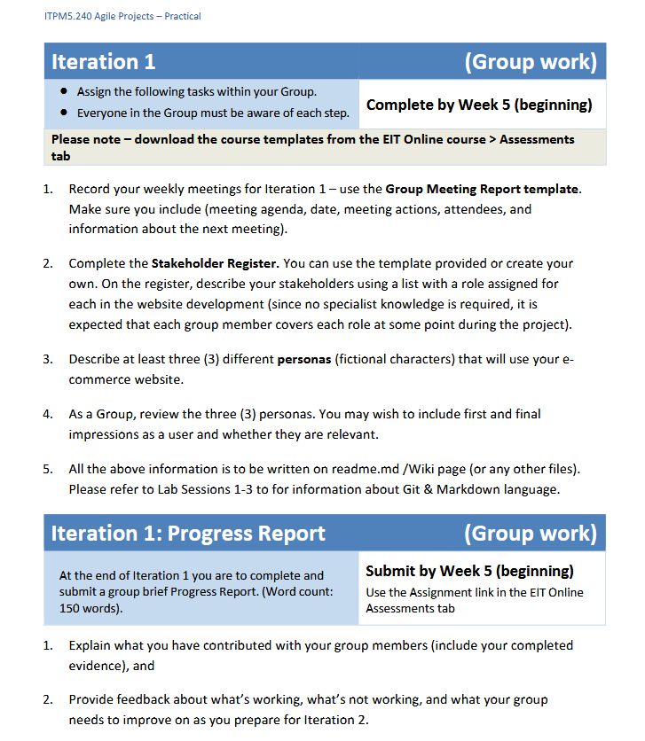
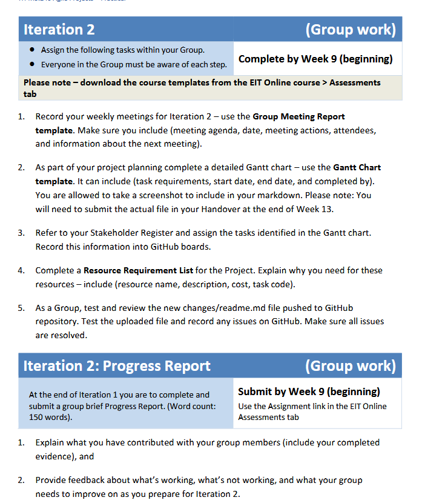
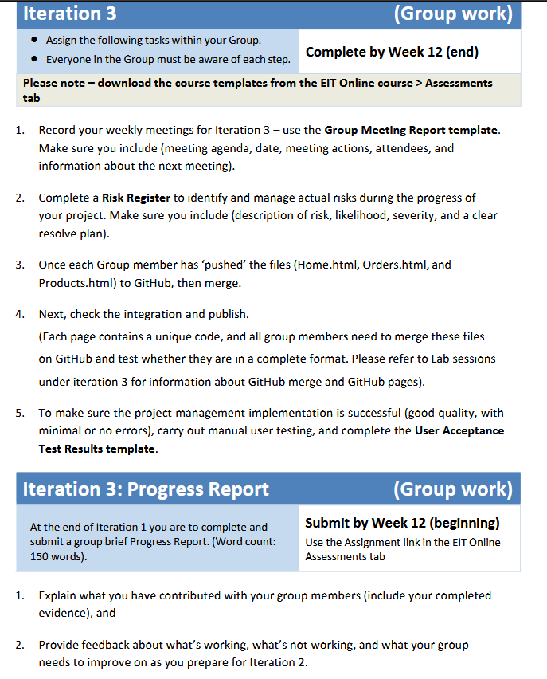

# Agile Projects
Group members: Kyle, Maraea, Liam 
This is our joint repository for our "Agile Projects" groupwork assignment. 

## Iteration 1

### Assignment Requirements:
<!--Assignment 1 requirements screenshots-->
> 

- *Personas*
	- Personas:
		- [Jennifer Michael](Iteration-one/Personas/"Jennifer.md")
		- [Jaga Grahame](Iteration-one/Personas/"Jaga_Grahame.md")
		- [Joe Rogers](Iteration-one/Personas/"Joe_Rogers.md")
		- [Barry Whitmore](Iteration-one/Personas/"Barry_Whitmore.md")
		- [Konstadina O'Boyle](Iteration-one/Personas/"Konstadina O'Boyle.md")
- [*Persona Reviews document*](Iteration-one/Persona_review.md)

- *Minutes/meeting notes* 
	- [Meeting notes 1](Iteration-one/Minutes/meeting-one.md) - Maraea
	- [Meeting notes 2](Iteration-one/Minutes/meeting-two.md) - Kyle
	- [Meeting notes 3](Iteration-one/Minutes/meeting-three.md) - Luke/Kyle
- [*Stakeholder Register*](Iteration-one/StakeHolder-Register.md) - Kyle

## Iteration 2

### Assignment Requirements
>
<!--Assignment 2 requirements screenshots-->

- *Minutes/meeting notes* 
	- [Meeting notes 1](Iteration-two/Minutes/meeting-four.md) - Maraea
	- [Meeting notes 2](Iteration-one/Minutes/meeting-five) - tbd

- [*Resource Requirements*](Iteration-two/RESOURCE_REQUIREMENTS.md) - Kyle

## Iteration 3

### Assignment Requirements

>
<!--Assignment 3 requirements screenshots-->

---

# Contributors

- Liam (ParadoxPrime)
- Maraea (axewpokeman23)
- Kyle (ObseleteAnti)
- Luke (g59smileyface-bot)
